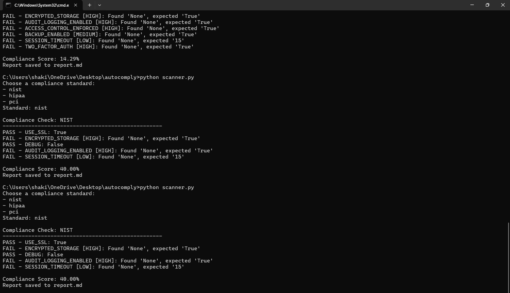
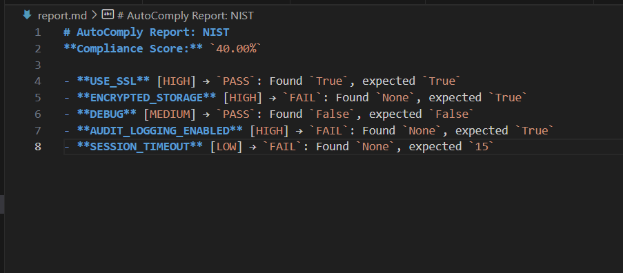
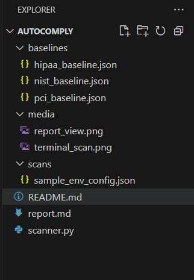

# AutoComply

**Automated Configuration Drift & Cybersecurity Compliance Checker**

AutoComply is a lightweight, CLI-based tool designed to scan system or application environment configurations against major cybersecurity compliance standards like **NIST**, **HIPAA**, and **PCI-DSS**. It detects configuration drift, flags non-compliant settings, and generates a Markdown report with a compliance score and severity levels.

---

## 🚀 Features

- ✅ Supports multiple compliance standards (NIST, HIPAA, PCI-DSS)
- 📊 Generates detailed Markdown reports with:
  - PASS/FAIL status
  - Compliance Score (in %)
  - Severity levels: HIGH / MEDIUM / LOW
- 🔁 Easy to extend with new rules and standards
- 📁 JSON-based rule definitions

---

## 📁 Project Structure

```

autocomply/
├── scanner.py                  # Main script
├── report.md                   # Generated compliance report
├── scans/
│   └── sample\_env\_config.json  # Input environment config (to scan)
└── baselines/
├── nist\_baseline.json
├── hipaa\_baseline.json
└── pci\_baseline.json
├── media/
│   ├── terminal_scan.png
│   ├── report_view.png
│   └── folder_structure.png

````

---

## 🛠️ How It Works

1. You provide a system/environment configuration as a JSON file.
2. Select a compliance standard (NIST, HIPAA, PCI).
3. AutoComply compares your config against that standard’s baseline.
4. Generates a `report.md` with results, score, and severity levels.
---

## 🖼️ Screenshots

### 🔹 Terminal Output


### 🔹 Generated Report


### 🔹 Project Folder Structure


---


## 🧪 Example Usage

Run the tool:

```bash
python scanner.py
````

Select a compliance standard when prompted:

```
Choose a compliance standard:
- nist
- hipaa
- pci
Standard: hipaa
```

View the output in your terminal and in `report.md`.

---

## 📄 Sample Baseline Rule

```json
"USE_SSL": {
  "expected": "True",
  "severity": "HIGH"
}
```

---

## ✅ Example Config (`scans/sample_env_config.json`)

```json
{
  "DEBUG": "False",
  "USE_SSL": "True",
  "SECURE_HSTS_SECONDS": "11100000",
  "ALLOWED_HOSTS": ["localhost", "127.0.0.1"],
  "SESSION_COOKIE_SECURE": "True",
  "CSRF_COOKIE_SECURE": "False",
  "ENCRYPTED_STORAGE": "True",
  "AUDIT_LOGGING_ENABLED": "True",
  "SESSION_TIMEOUT": "15",
  "ACCESS_CONTROL_ENFORCED": "True",
  "BACKUP_ENABLED": "True",
  "TWO_FACTOR_AUTH": "True",
  "CARD_DATA_ENCRYPTED": "True",
  "LOGGING_ENABLED": "True",
  "FIREWALL_ENABLED": "True",
  "DEFAULT_PASSWORDS_CHANGED": "True",
  "ACCESS_RESTRICTED": "True",
  "PATCHING_UP_TO_DATE": "True"
}
```


## 💡 Extend It

To add your own standard or modify rules, edit files inside the `baselines/` folder. Each rule must include:

* `expected`: expected value
* `severity`: LOW / MEDIUM / HIGH

---

## 📚 Standards Covered

* [NIST Cybersecurity Framework](https://www.nist.gov/cyberframework)
* [HIPAA Security Rule](https://www.hhs.gov/hipaa/)
* [PCI-DSS](https://www.pcisecuritystandards.org/)

---

## 🔒 Disclaimer

AutoComply is for educational and prototype/demo purposes. Always consult security professionals before relying on automated tools for compliance in production environments.

---

## 👨‍💻 Author

Built by a cybersecurity enthusiast interested in malware analysis, reverse engineering, and secure system design.

